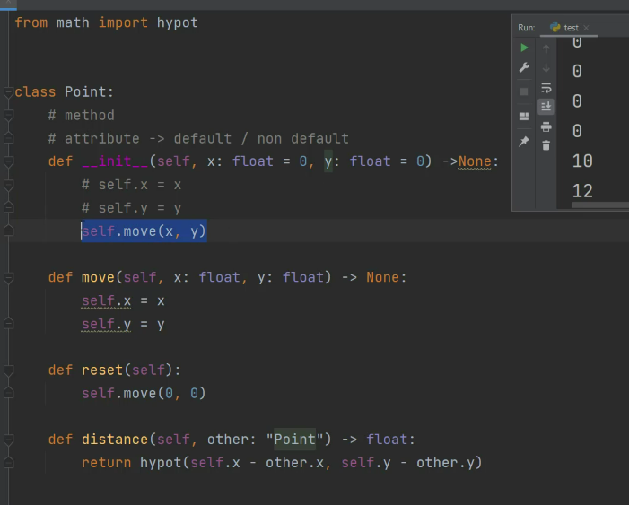

# فصل ۱۰ کلاس در پایتون [سبزلرن](https://sabzlearn.ir/course/python/)

## اشیاء در پایتون (جلسه ۸)


## ساخت کلاس و اضافه کردن attribute و method به آن (جلسه ۹)


```python
class PascalCase:
    pass

def snake_case():
    pass
```
قوانین pep8 که بهتر است در نامگذاری کلاس و توابع استفاده کنیم
<br/><br/><br/>


```python
class Point:
    pass

p1 = Point()

#  اضافه کردن صفت  (attribute)
p1.x = 3
p1.y = 5

print(p1.x)
print(p1.y)
```
اضافه کردن صفت  (attribute)
<br/><br/><br>

```python
class Point:
    #  اضافه کردن رفتار (method)
    def restart(self):
        self.x = 0
        self.y = 0

p1 = Point()

#  اضافه کردن صفت  (attribute)
p1.x = 3
p1.y = 5

print("x : ",p1.x)
print("y : ",p1.y)

p1.restart()
# or
# Point.restart(p1)

print("x : ",p1.x)
print("y : ",p1.y)
```
 اضافه کردن رفتار (method)
 <br><br><br>


نوشتن متود حذف به گونه دیگر
<br><br>


کلاس برای پیدا کردن فاصله دو نقطه

## [مقدار دهی اولیه شی (جلسه ۱۰)](https://sabzlearn.ir/lesson/25-26935/)

```python
# __new__ --> Create object (ساخت شی)
# __init__ -->initialize object (مقداردهی شی)

class Point:
    # method
    # atribute --> defult / non defult

    #         نوع مقدار خروجی      نوع پارامتر ورودی
    def __init__ (self , x:float , y:float ) -> None:
        self.x = x
        self.y = y
        # atribute -> non defult |^|

p1 = Point(10,12)

print("x : ",p1.x)
print("y : ",p1.y)
```
مقدار دهی اولیه بدون مقدار پیشفرض (هنگام صدا زدن مجبوریم مقدار بدهیم)
<br><br>

```python
# __new__ --> Create object (ساخت شی)
# __init__ -->initialize object (مقداردهی شی)

class Point:
    # method
    # atribute --> defult / non defult
    
    #          نوع مقدار خروجی      نوع پارامتر ورودی
    def __init__ (self , x:float = 0 , y:float = 0 ) -> None:
        self.x = x
        self.y = y
        # atribute -> defult |^|

p1 = Point()

print("x : ",p1.x)
print("y : ",p1.y)
```
مقدار دهی اولیه یا مقدار پیشفرض بوسیله نوشتن atribute
<br><br>

```python
# __new__ --> Create object (ساخت شی)
# __init__ -->initialize object (مقداردهی شی)

class Point:
    # method
    # atribute --> defult / non defult
    
    #                   نوع مقدار خروجی      نوع پارامتر ورودی
    def __init__ (self , x:float = 0 , y:float = 0 ) -> None:
        self.move(x,y)
        # atribute -> method |^|

    def move(self, x:float ,y:float) -> None:
        self.x = x
        self.y = y

p1 = Point()

print("x : ",p1.x)
print("y : ",p1.y)
```
مقدار دهی اولیه یا مقدار پیشفرض بوسیله متد دیگر
<br><br>


