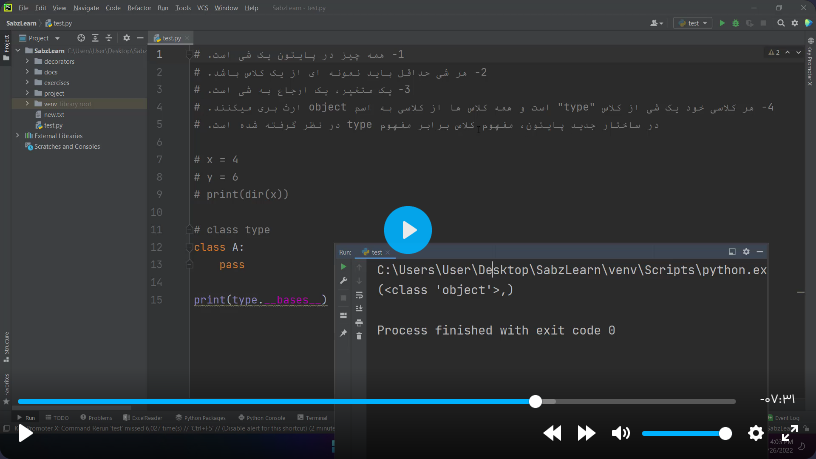
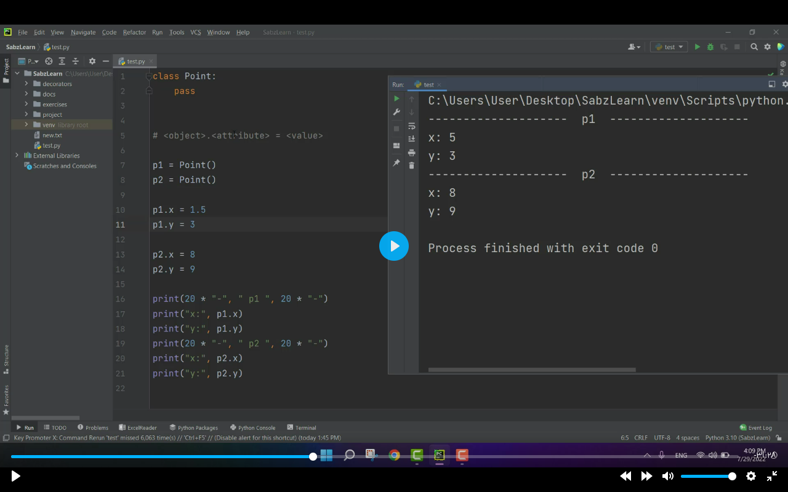
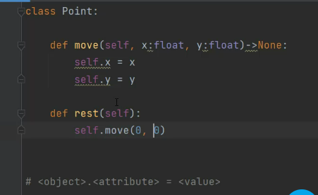
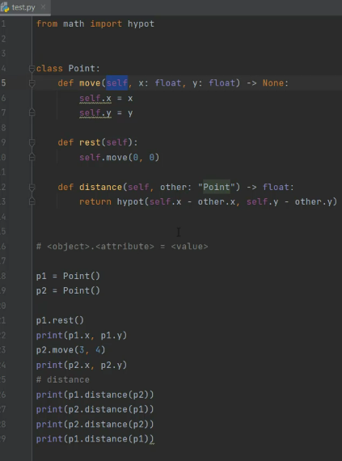
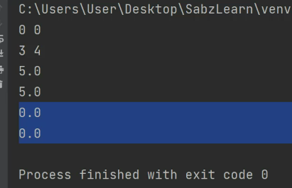

# فصل ۱۰ کلاس در پایتون (سبزلرن)

## اشیاء در پایتون (جلسه ۸)



## ساخت کلاس و اضافه کردن attribute و method به آن (جلسه ۹)


```python
class PascalCase:
    pass

def snake_case():
    pass
```
قوانین pep8 که بهتر است در نامگذاری کلاس و توابع استفاده کنیم
<br/><br/><br/>



```python
class Point:
    pass

p1 = Point()

#  اضافه کردن صفت  (attribute)
p1.x = 3
p1.y = 5

print(p1.x)
print(p1.y)
```
اضافه کردن صفت  (attribute)
<br/><br/><br>

```python
class Point:
    #  اضافه کردن رفتار (method)
    def restart(self):
        self.x = 0
        self.y = 0

p1 = Point()

#  اضافه کردن صفت  (attribute)
p1.x = 3
p1.y = 5

print("x : ",p1.x)
print("y : ",p1.y)

p1.restart()
# or
# Point.restart(p1)

print("x : ",p1.x)
print("y : ",p1.y)
```
 اضافه کردن رفتار (method)
 <br><br><br>



نوشتن متود حذف به گونه دیگر
<br><br>




کلاس برای پیدا کردن فاصله دو نقطه
